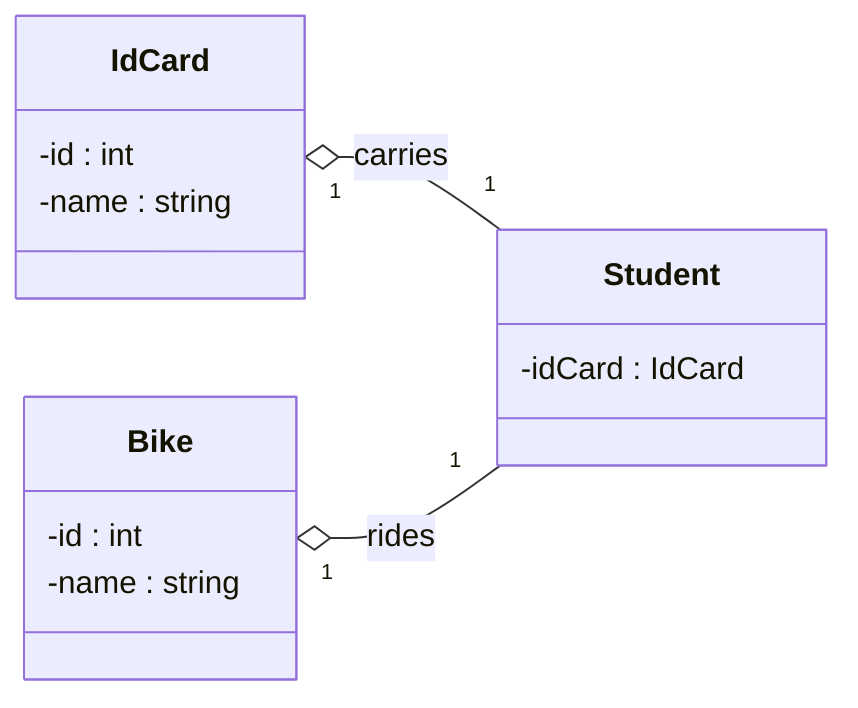

# Class Diagrams

Reference: https://mermaid-js.github.io/mermaid/#/classDiagram

```mermaid
classDiagram
  direction RL
  class Student {
    -idCard : IdCard
  }
  class IdCard{
    -id : int
    -name : string
  }
  class Bike{
    -id : int
    -name : string
  }
  Student "1" --o "1" IdCard : carries
  Student "1" --o "1" Bike : rides
```
