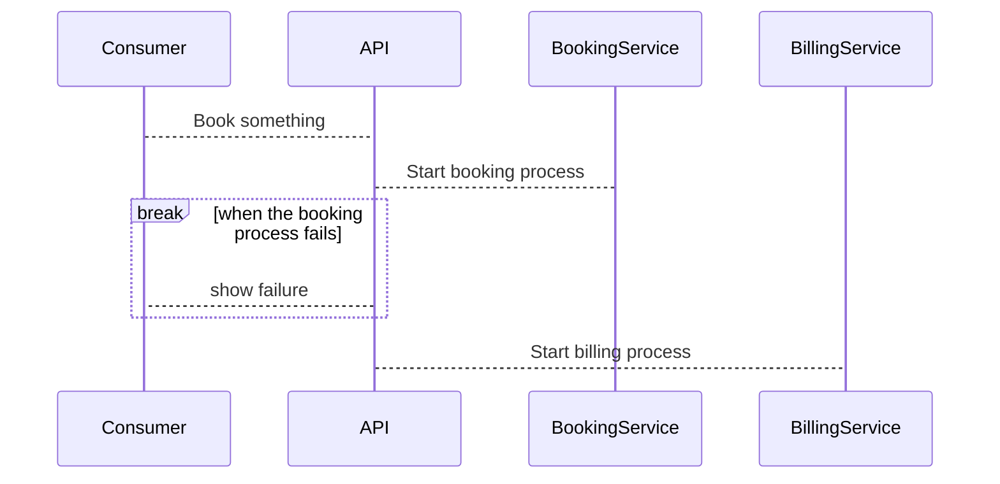

# Sequence Diagram

Reference: https://mermaid-js.github.io/mermaid/#/sequenceDiagram

```mermaid
sequenceDiagram
  Consumer-->API: Book something
  API-->BookingService: Start booking process
  break when the booking process fails
    API-->Consumer: show failure
  end
  API-->BillingService: Start billing process
```
