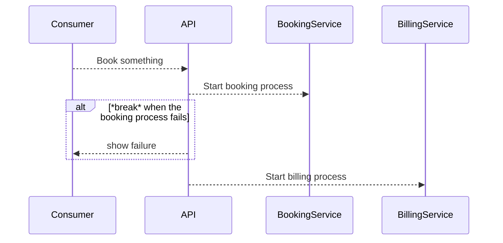
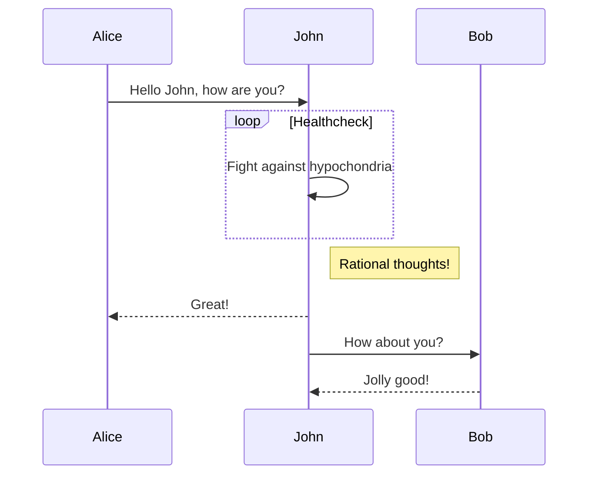

# Sequence Diagram

Reference: https://mermaid-js.github.io/mermaid/#/sequenceDiagram

*Github mermaid does not support the "break" or "ref" frames; "alt" and "loop" frames are supported.*

```mermaid
sequenceDiagram
  Consumer-->>API: Book something
  API-->>BookingService: Start booking process
  alt *break* when the booking process fails
    API-->>Consumer: show failure
  end
  API-->>BillingService: Start billing process
```

```mermaid
sequenceDiagram
Alice->>John: Hello John, how are you?
loop Healthcheck
    John->>John: Fight against hypochondria
end
Note right of John: Rational thoughts!
John-->>Alice: Great!
John->>Bob: How about you?
Bob-->>John: Jolly good!
```
