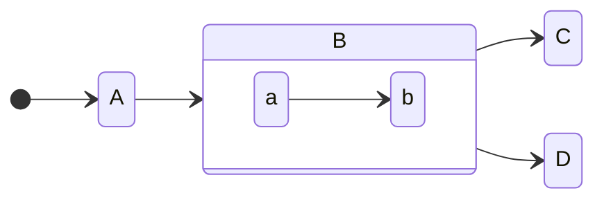

# State Diagram

Reference: https://mermaid-js.github.io/mermaid/#/stateDiagram

```mermaid
stateDiagram
    direction LR
    [*] --> A
    A --> B
    B --> C
    state B {
      direction LR
      a --> b
    }
    B --> D
```
